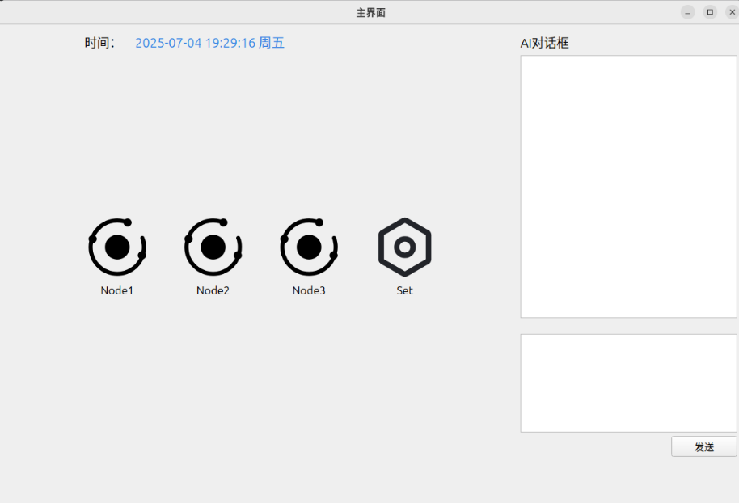

# 龙芯多节点环境监测系统

基于 Qt/C++ 开发的桌面端环境监测程序，面向龙芯平台工业物联网场景。程序通过串口接收多个传感节点的数据，实时展示温度、湿度、光照和烟雾浓度，并可通过 MQTT 上报至云端。



## 功能

- 支持 3 个环境监测节点的状态与数据展示。
- 通过串口接收 ESP8266 转发的传感器数据。
- 为温度、湿度、光照、烟雾数据绘制实时曲线。
- 支持阈值配置、节点离线检测与异常告警。
- 通过 MQTT 向云端平台上报传感器数据。

## 技术栈

- C++17 与 Qt Widgets
- Qt Charts、Qt Network、Qt SerialPort
- MQTT 3.1.1（项目内置 QMQTT 源码）
- 龙芯平台网关、ESP8266 无线通信与多传感器节点

## 目录结构

```text
.
|- Loong_disp.pro                 # Qt/qmake 工程文件
|- src/
|  |- main.cpp                    # 程序入口
|  |- ui/                         # 主界面、节点页与设置页
|  |- services/                   # 串口、MQTT、告警任务
|  `- config/                     # 本地设备配置示例
|- resources/pic/                 # Qt 资源文件与界面图标
|- third_party/mqtt/              # 随项目提供的 QMQTT 源码
`- docs/                          # 设计报告、技术演示页与界面截图
```

## 环境要求

- Qt 5.15+ 或 Qt 6（需安装 Widgets、Charts、Network、SerialPort 模块）
- 支持 C++17 的编译器
- 可访问的串口设备与 MQTT 服务（使用完整功能时需要）

## 构建与运行

1. 使用 Qt Creator 打开 `Loong_disp.pro`。
2. 选择已安装的 Qt Kit 后执行“运行 qmake”。
3. 编译并运行项目。

也可以在已配置 Qt 命令行环境的终端中执行：

```powershell
qmake Loong_disp.pro
make
```

Windows 上的实际构建命令取决于 Qt Kit，可能是 `nmake` 或 `mingw32-make`。

## 本地配置

项目不会提交真实的云端设备凭证或 Wi-Fi 密码。首次运行前，请复制配置模板：

```powershell
Copy-Item src/config/device_config.example.h src/config/device_config.h
```

然后仅在本机编辑 `src/config/device_config.h`，填写 MQTT 设备 ID、设备密钥、服务地址、客户端 ID，以及 ESP8266 的 Wi-Fi 名称和密码。该文件已被 `.gitignore` 排除，不会被上传。

> 本项目曾提交过云端凭证。请在云平台立即轮换原设备密钥，再填写新的本地配置；仅从源码删除旧密钥并不能使已经泄露的密钥失效。

## 串口数据格式

程序会从 ESP8266 的 `+IPD` 数据中解析逗号分隔字段：

```text
节点编号,光照,温度,湿度,烟雾
```

例如：

```text
1,320,25.6,61.2,88
```

## 文档

- [系统设计报告](docs/industrial-wireless-iot-sensor-system-report.pdf)
- [技术演示页面](docs/technical-demo.html)

## 贡献与许可

当前仓库尚未声明开源许可证。提交外部贡献或复用代码前，请先与仓库维护者确认授权方式。
